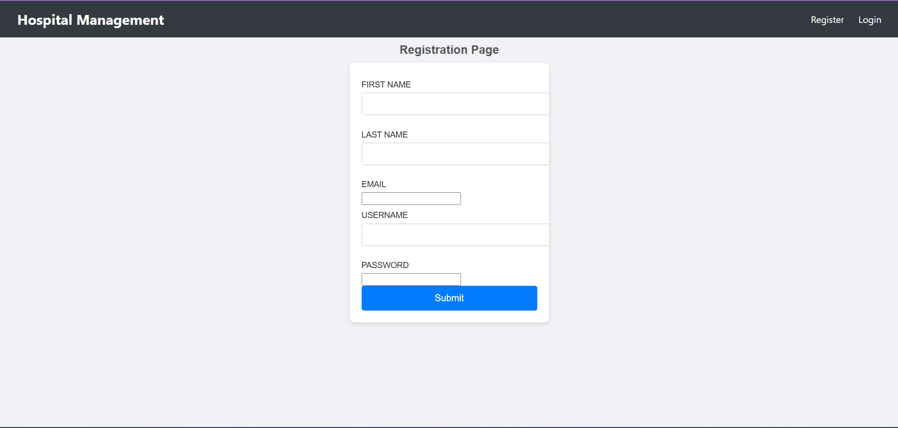
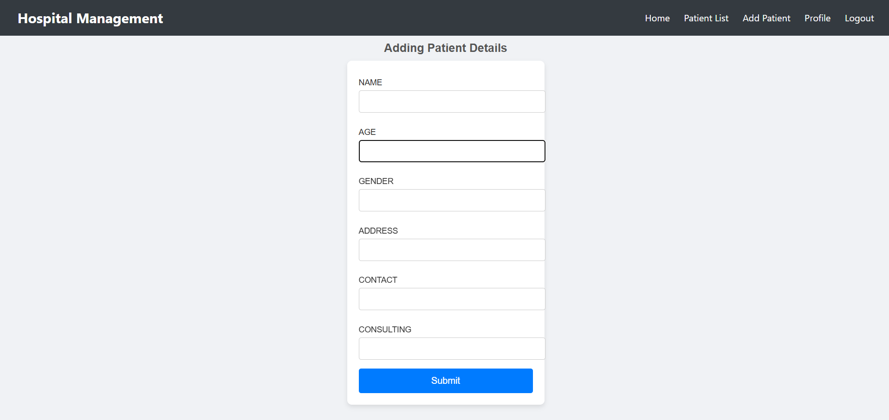
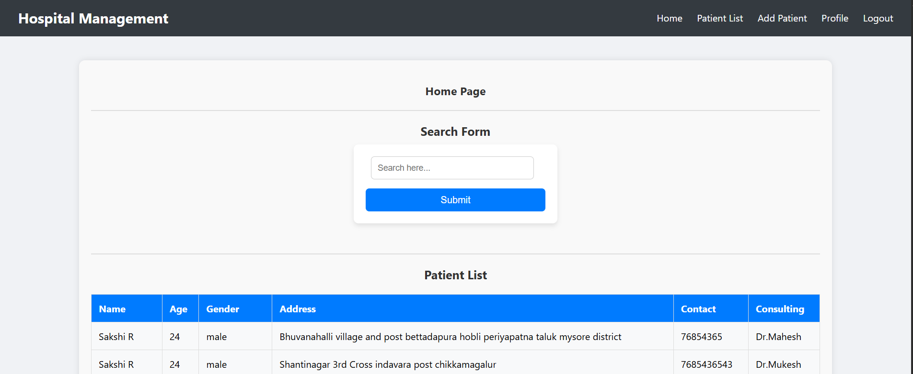

<!DOCTYPE html>
<html lang="en">
<head>
    <meta charset="UTF-8" />
    <title>🏥 Hospital Management System</title>
</head>
<body>

<h1>🏥 Hospital Management System</h1>

A <b>Django-based web application</b> for managing hospital operations including patient registration, doctor schedules, appointments, and medical records, making hospital management efficient and organized.

<h2>📌 Project Objective</h2>
<ul>
    <li>Manage patient registrations efficiently</li>
    <li>Schedule and track doctor appointments</li>
    <li>Maintain accurate medical records</li>
    <li>Provide admins and staff with easy-to-use dashboards</li>
</ul>

<h2>📊 Screenshots</h2>

<h3>Home Page</h3>

<h3>Patient List</h3>

<h3>Admin Dashboard</h3>

<h2>🛠️ Tools & Technologies</h2>
<ul>
    <li>Python, Django, SQLite/MySQL</li>
    <li>Frontend: HTML, CSS, Bootstrap, JavaScript</li>
    <li>Environment: VS Code, Virtual Environment</li>
    <li>Version Control: Git & GitHub</li>
</ul>

<h2>📂 Project Structure</h2>
<pre>
Hospital-Management-System/
│── manage.py
│── myproject/
│   │── settings.py
│   │── urls.py
│   │── wsgi.py
│── apps/
│── templates/
│── static/
│── db.sqlite3
│── requirements.txt
│── README.html
│── images/
</pre>

<h2>📊 Methodology</h2>
<ol>
    <li><b>Data Management</b>
        <ul>
            <li>Create models for Patients, Doctors, Appointments, and Medical Records</li>
            <li>Use Django ORM for CRUD operations</li>
            <li>Handle validations and relationships between models</li>
        </ul>
    </li>
    <li><b>Views & Templates</b>
        <ul>
            <li>Create views for listing, adding, editing, and deleting records</li>
            <li>Use Django templates for rendering UI</li>
            <li>Integrate Bootstrap for responsive design</li>
        </ul>
    </li>
    <li><b>User Interaction</b>
        <ul>
            <li>Implement forms for patient registration and appointment booking</li>
            <li>Dashboard for admin and staff</li>
            <li>Search and filter functionalities</li>
        </ul>
    </li>
</ol>

<h2>📌 Features</h2>
<ul>
    <li>Patient registration and management</li>
    <li>Doctor scheduling and appointment booking</li>
    <li>Medical records management</li>
    <li>Admin and staff dashboards</li>
    <li>Search, edit, and delete functionalities</li>
</ul>

<h2>🚀 How to Run Locally</h2>
<ol>
    <li>Clone the repository
        <pre>git clone https://github.com/sohampowar/Hospital-Management-Project.git</pre>
    </li>
    <li>Navigate to the project folder
        <pre>cd Hospital-Management-Project</pre>
    </li>
    <li>Create a virtual environment
        <pre>python -m venv venv</pre>
    </li>
    <li>Activate the virtual environment
        <pre>
<!-- Windows -->
venv\Scripts\activate

<!-- Linux / Mac -->
source venv/bin/activate
        </pre>
    </li>
    <li>Install dependencies
        <pre>pip install -r requirements.txt</pre>
    </li>
    <li>Apply migrations and run the server
        <pre>
python manage.py makemigrations
python manage.py migrate
python manage.py runserver
        </pre>
    </li>
</ol>

<h2>🙋‍♂️ Author</h2>

<b>Soham U Powar</b> 
B.Tech in Computer Science & Engineering 
GitHub: <a href="https://github.com/sohampowar">SohampowarGithub</a> 
LinkedIn: <a href="https://www.linkedin.com/in/soham-powar-383593271/">SohampowarLinkedIn</a>

</body>
</html>
